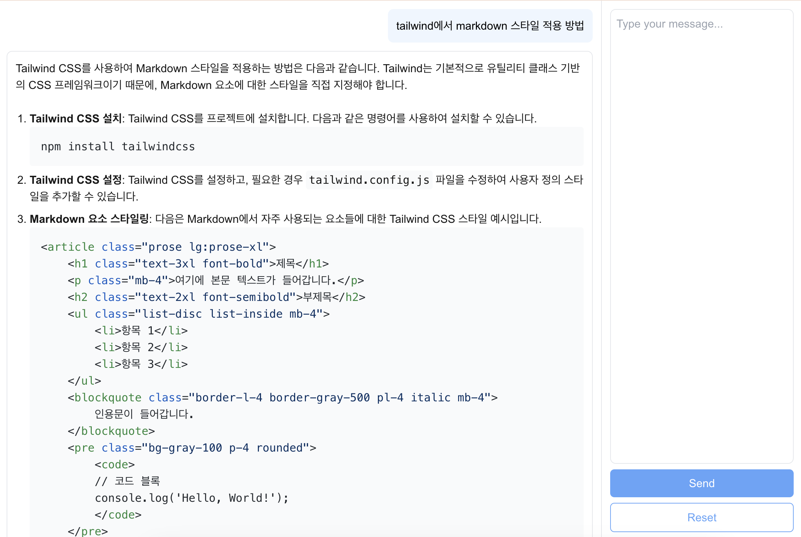

# Socratone AI Toolkit

AI를 이용한 도구 모음 웹 어플리케이션

.env에 키를 넣고 로컬에서 사용합니다.



## 프로젝트 구조

```
socratone-ai-toolkit/
├── apps/
│   ├── web/              # Next.js 프론트엔드
│   └── server/           # Flask 백엔드
├── packages/
│   └── shared-types/     # 공유 타입 및 상수
├── turbo.json
└── pnpm-workspace.yaml
```

## 사용 가능 AI 모델

- OpenAI (GPT-4o, GPT-4.1, GPT-5)
- Anthropic (Claude Sonnet 4)
- Deepseek
- ExaOne

## 실행 방법

### Prerequisites

아래 앱 설치가 필요합니다.

- [Node.js](https://nodejs.org) (>= 18)
- [pnpm](https://pnpm.io) (>= 9.15.0)
- [Docker](https://www.docker.com) 설치
- [Ollama](https://ollama.com) 설치
  - `deepseek-r1:7b`
  - `exaone3.5:latest`

### Env

`.env` 파일에 아래 키를 넣어야 합니다.

https://platform.openai.com/settings/organization/api-keys

```
OPENAI_API_KEY=???
ANTHROPIC_API_KEY=???
FLASK_ENV="production"
```

### Scripts

**1\. 의존성 설치**

```bash
pnpm install
```

**2\. 개발 모드**

```bash
pnpm dev
```

**3\. 빌드**

```bash
pnpm build
```

**4\. 프로덕션 실행**

```bash
pnpm start
```

**5\. 링크**

http://localhost:4000

## Open AI 토큰 사용량 확인

https://platform.openai.com/settings/organization/usage

## 개발 환경

### 파이썬 익스텐션

- [Pylint](https://marketplace.visualstudio.com/items?itemName=ms-python.pylint)
- [Black Formatter](https://marketplace.visualstudio.com/items?itemName=ms-python.black-formatter)
