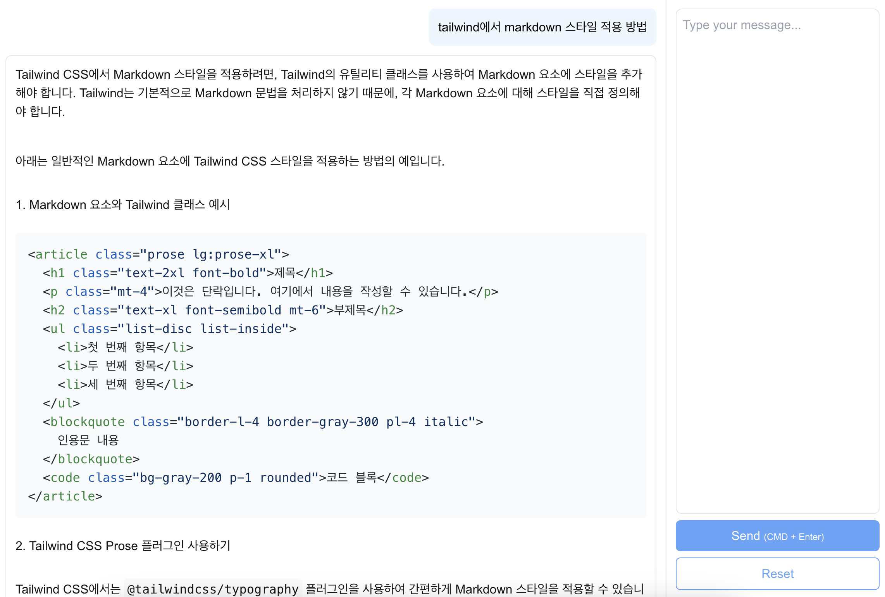

# Socratone AI Toolkit

AI를 이용한 도구 모음 웹 어플리케이션

[chatgpt.com](https://chatgpt.com) 대신 사용하기 위해 작성했습니다.\
.env에 키를 넣고 로컬에서 사용합니다.



다음과 같은 장점이 있습니다.

- 쓴 만큼만 비용을 낼 수 있다.
- system role의 message를 설정할 수 있다. (현재는 개발자로 설정)

## 실행 방법

### Env

아래 링크에서 발급한 키를 `.env`에 넣어야 합니다.

https://platform.openai.com/settings/organization/api-keys

```
OPENAI_API_KEY=???
FLASK_ENV="production"
```

### Scripts

**1\. 빌드**

```
pnpm build
```

**2\. 실행**

```
pnpm start
```

**3\. 링크**

http://localhost:4000

## 서버 실행 방법

도커가 설치돼 있어야 한다.

```
docker-compose up --build
```

## 사용량 확인

https://platform.openai.com/settings/organization/usage

## 개발 환경

### 파이썬 익스텐션

- [Pylint](https://marketplace.visualstudio.com/items?itemName=ms-python.pylint)
- [Black Formatter](https://marketplace.visualstudio.com/items?itemName=ms-python.black-formatter)
